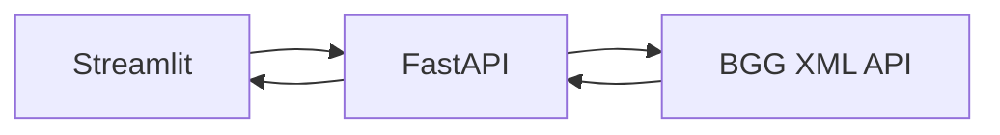

# Board Game Search

Webová aplikace pro vyhledávání deskových her pomocí BoardGameGeek XML API.

## Live demo

- Streamlit aplikace: https://bgsearch.streamlit.app/
- FastAPI dokumentace: https://board-game-search-fastapi.onrender.com/docs

## Architektura



Streamlit poskytuje uživatelské rozhraní. FastAPI funguje jako backend, komunikuje s BoardGameGeek, parsuje XML a vrací data ve formátu JSON.

## Funkce

- vyhledávání deskových her a rozšíření,
- zobrazení detailu hry podle BGG ID,
- obrázek a popis hry,
- rok vydání a počet hráčů,
- hodnocení a obtížnost,
- autoři, vydavatelé, mechaniky a kategorie,
- validace dat pomocí Pydantic,
- automatická OpenAPI dokumentace,
- cache opakovaných BGG požadavků,
- automatické testy XML parseru.

## Použité technologie

- Python
- FastAPI
- Streamlit
- Pydantic
- Requests
- ElementTree
- Pytest
- Render
- Streamlit Community Cloud

## Lokální spuštění

### 1. Stažení repozitáře

```bash
git clone https://github.com/vyslouziltomas/Board_game_search_fastAPI.git
cd Board_game_search_fastAPI
```

### 2. Instalace závislostí

```bash
python -m pip install -r requirements-dev.txt
```

### 3. Konfigurace

V hlavní složce projektu vytvoř soubor `.env`:

```env
BGG_TOKEN=tvuj_bgg_token
API_URL=http://127.0.0.1:8000
```

Pro použití BGG XML API je potřeba schválená aplikace a vlastní Bearer token.

Soubor `.env` se nesmí nahrát na GitHub.

### 4. Spuštění FastAPI

```bash
python -m uvicorn main:app --reload
```

FastAPI poběží na:

```text
http://127.0.0.1:8000
```

Interaktivní dokumentace:

```text
http://127.0.0.1:8000/docs
```

### 5. Spuštění Streamlitu

Ve druhém terminálu spusť:

```bash
python -m streamlit run streamlit_app.py
```

Streamlit se otevře na:

```text
http://localhost:8501
```

## API endpointy

### Vyhledávání her

```http
GET /games?query=Catan
```

### Detail hry

```http
GET /games/13
```

### Kontrola API

```http
GET /
```

## Testy

Testy spustíš příkazem:

```bash
python -m pytest
```

## Struktura projektu

```text
.
├── tests/
│   └── test_xml_parser.py
├── bgg_client.py
├── main.py
├── models.py
├── requirements.txt
├── requirements-dev.txt
├── streamlit_app.py
└── xml_parser.py
```

## Zdroj dat

Data poskytuje BoardGameGeek XML API2.